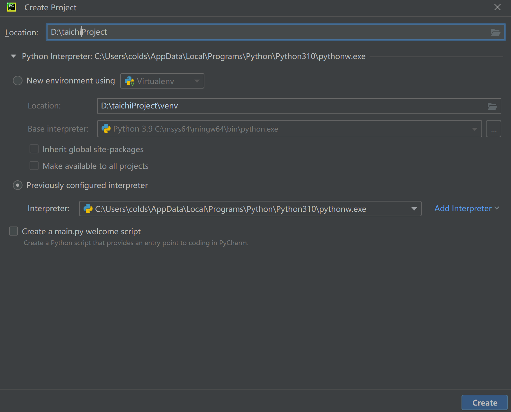

# Taichi入门

???+ note "前言"
    Taichi 是一个基于 Python 的领域特定语言，专为高性能并行计算设计。

## 安装
``` bash
pip install taichi
```
## 在pycharm中新建一个Pycharm项目

???+ note "注意"
    这里选择 `python Interpreter` 时需要选择`python`的默认安装目录中的`python.exe`,不然会导致已经下载的第三方库（比如taichi）在pycharm中无法使用

## 开始写Taichi代码

`taichi`本来是用来做计算机图形学的内容，由于笔者目前对计算机图形学并不太了解，这里简单演示一下如何用`taichi`来绘制一条直线

### 导入taichi模块

```python
import taichi as ti
```
### 初始化taichi

```python
ti.init(arch = ti.gpu)
```
此行调用 `ti.init()`，根据传入参数定制 Taichi 运行时。 目前，我们只介绍最重要的参数：`arch`。

参数 `arch` 指定**后端**来执行已编译的代码。 后端可以是 `ti.cpu` 或 `ti.gpu`。 当指定后端为 `ti.gpu` 时，Taichi 按照 `ti.cuda`、`ti.vulkan`、`ti.opengl/ti.metal` 的优先顺序选择后端。 如果没有 GPU 架构可用，Taichi 回退到 CPU 设备。

你也可以直接指定要使用的 GPU 后端。 例如，设置 `arch=ti.cuda`，在 CUDA 上运行程序。 如果目标架构不可用，Taichi 会报错。

### 定义一段直线

```python
import numpy as np
X = np.random.random((1, 2)) #x 为起点
Y = np.random.random((1, 2)) #y 为终点
```


### 在taichi提供的图像界面上显示

```python
n = 560
gui = ti.gui("我的第一个taichi作品",res = (n*2,n))
for i in range(10000):
    gui.lines(begin=X, end=Y, radius=2, color=0x068587)
    gui.show()
```
???+ info "注意"
    为了防止图形界面一闪而过，我们还要加入以下代码
    ```python
    while gui.running:
        gui.show()
    ```


