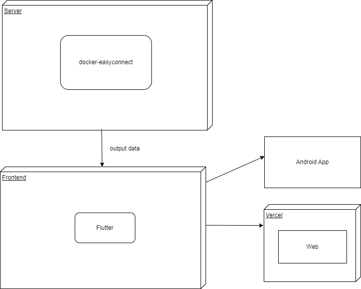

## 体系架构




# 开发过程

## 后端开发

首先进行后端开发，根据网上关于docker-easyconnect的使用教程，我首先得买一台Linux服务器，正好之前在哔哩哔哩上有人推荐的阿里云ecs，99元/年，虽然各大公司的云产品的价格相比几年前下降了不少，但我还是咬牙买下了一台 Ubuntu 18.04

### 安装docker-easyconnect

1.首先安装docker

```bash
curl -fsSL https://test.docker.com -o test-docker.sh 
sudo sh test-docker.sh
```

2.安装docker-easyconnect

```bash
sudo yum remove -y docker docker-client docker-client-latest docker-common docker-latest docker-latest-logrotate docker-logrotate docker-engine
sudo yum install -y yum-utils
sudo yum-config-manager --add-repo http://mirrors.aliyun.com/docker-ce/linux/centos/docker-ce.repo
sudo yum install -y docker-ce docker-ce-cli containerd.io
sudo systemctl start docker
sudo systemctl enable docker
```

3.启动docker-easyconnect服务

```bash
docker run --device /dev/net/tun --cap-add NET_ADMIN -ti -p 127.0.0.1:1080:1080 -p 127.0.0.1:8888:8888 -e EC_VER=7.6.3 -e CLI_OPTS="-d 教务系统ip -u 学号 -p 校园网密码" hagb/docker-easyconnect:cli  
```

注意，这里的教务系统ip只能是ip格式，可以通过ping 命令来获取ip

现在`docker-easyconnect`就算部署成功

我们使用写一个python测试一下是否能正确访问教务系统

```python
import requets
r=requests.post(url=url,data=data,headers=headers,proxies={'http':'127.0.0.1:8888'})
print(r.statuscode)
```

当statuscode为200时代表部署成功。

### Flask搭建api

下一步是教务系统课表等内容的获取，这个在之前在编写原生Android版好好好课程表时候我已经使用python写好了，由于python也跨平台，我可以使用之前写的脚本。

获取到课程表数据之后我该如何以api的形式返回给客户端呢，我想到了Flask，由于之前部署在网页端的项目几乎都是用Flask搭建的，这个api的搭建对我来说也显得轻车熟路，

下面记录一下踩坑记录以及我是如何解决的


#### 1.问题：linux端跑Windows端写好的python代码出现编码错误问题

解决：在python文件之前加上下面代码

```python
#!/usr/bin/python
# -*- coding: UTF-8 -*-
```

#### 2.问题：每次成功请求到一个用户的信息时，下载输入错误的信息仍然嗯请求得到

解决：
这个问题困扰我半天，我第一反应就是cookie的问题，但是误以为时Flask每次请求后保存的cookie，因为当我直接执行获取课表的py脚本时不会出现这个问题，我网上找了好多资料来清除Flask的cookie，都没有效果，山重水复之际，我将实现转到了py脚本，我尝试了在代码中连续模拟请求两次（不中断程序），结果问题复发了，这说明就是脚本自身问题与Flask无关。

在脚本中，我在结束位置加入以下代码

```python
 session.cookies.clear()
```

清除cookie，最终问题得到解决


#### 3.API的健壮性

当输入表单信息有误时，可能会触发500错误，根据Flask的报错信息，我发现时由于代码中没有做异常处理，于是我对代码进行优化，在可能出现错误的地方进行了判断，极大提高了api的健壮性与容错能力


#### 4.在使用flask run启动Flask服务时，会显示warning

```bash
 * Debug mode: off
WARNING: This is a development server. Do not use it in a production deployment. Use a production WSGI server instead.
 * Running on http://127.0.0.1:5000
Press CTRL+C to quit
```

这些都是由于flask没有运行在稳定的环境

我们可以使用`Gunicorn`来帮忙

安装Gunicorn

```python
pip install gunicorn
```

使用Gunicorn来启动flask服务

```python
gunicorn -b 0.0.0.0:8000 app:app
```

#### 5.在命令行中启动服务，退出时会导致服务终止

我们需要安装进程管理软件实现的进程管理，使得在推出服务器之后服务仍然能正常运行，我们这里使用Supervisor

1. 安装 Supervisor：

   ```
   sudo apt-get install supervisor
   ```

2. 创建一个新的 Supervisor 配置文件：

   ```
   sudo nano /etc/supervisor/conf.d/gunicorn.conf
   ```

3. 在配置文件中添加以下内容（根据您的设置进行修改）：

   ```
   [program:gunicorn]
   command=/path/to/your/virtualenv/bin/gunicorn -b 0.0.0.0:5000 app:app
   directory=/path/to/your/app/directory
   user=root
   autostart=true
   autorestart=true
   redirect_stderr=true
   stdout_logfile=/var/log/gunicorn.log
   ```

   确保将上述命令和路径配置为适合您的环境。

4. 保存并关闭文件。

5. 更新 Supervisor 配置并启动进程：

   ```
   sudo supervisorctl reread
   sudo supervisorctl update
   sudo supervisorctl start gunicorn
   ```

   这将读取新的配置文件、更新 Supervisor 并启动 `gunicorn` 进程。

现在，`gunicorn` 进程将由 Supervisor 管理，并且会在系统启动时自动启动。可以使用 `supervisorctl` 命令来管理进程，例如停止、重启或查看进程状态：

```pythn
sudo supervisorctl stop gunicorn
sudo supervisorctl restart gunicorn
sudo supervisorctl status
```

#### 6.API在外网无法访问

这里要指定flask服务运行在0.0.0.0

```python
gunicorn -b 0.0.0.0:5000 app:app
```

并且由于阿里云的安全策略，我们需要在`安全组`中开放5000端口

#### 7.重新进入服务器非重启关闭服务

先使用

```bash
netstat -tunlp
```

查看当前运行的服务以及端口

强制关闭

```bash
kill -9 pid
```

这样外网就能访问到啦


## 前端开发

基于flutter开发课程表的原因就是因为其跨平台特性，可以运行在web，ios，Windows以及Android端，这样可以极大可能收获用户。

下面记录flutter开发过程中的踩过的坑

### 1.修改flutterapp应用工程名称为gooodclaas之后，build异常

这时候只要在终端输入

```bash
flutter clean
```

### 2.flutter android 网络权限问题

在调试(debug)模式下不需要网络权限也能获取到课程数据，但是当发布为realease版本后，需要在app manifest 文件中加入网络权限（跟Android原生开发类似）

```xml
<uses-permission android:name="android.permission.INTERNET" />
```

这样app才能成功访问到网络.


### 3.flutter android签名问题

安卓应用发布都需要签名，而我开发的app都使用的我的签名pwxiao.jks，该签名创建后保存在了我的设备上，现在需要使用这个签名对我的flutter app进行签名

这个过程在官网有教程

#### 从 app 中引用密钥库

创建一个名为 `[project]/android/key.properties` 的文件，它包含了密钥库位置的定义。在替换内容时请去除 `< >` 括号：

```
storePassword=<password-from-previous-step>
keyPassword=<password-from-previous-step>
keyAlias=upload
storeFile=<keystore-file-location>
```

`storeFile` 在 Windows 上类似于 `C:\\Users\\<user name>\\upload-keystore.jks`。

#### 在 gradle 中配置签名

在以 release 模式下构建你的应用时，修改 `[project]/android/app/build.gradle` 文件，以通过 gradle 配置你的上传密钥。

1. 在 `android` 代码块之前将你 properties 文件的密钥库信息添加进去：

   *content_copy*

   ```
      def keystoreProperties = new Properties()
      def keystorePropertiesFile = rootProject.file('key.properties')
      if (keystorePropertiesFile.exists()) {
          keystoreProperties.load(new FileInputStream(keystorePropertiesFile))
      }
   
      android {
            ...
      }
   ```

   将 `key.properties` 文件加载到 `keystoreProperties` 对象中。

2. 找到 `buildTypes` 代码块：

   ```
      buildTypes {
          release {
              // TODO: Add your own signing config for the release build.
              // Signing with the debug keys for now,
              // so `flutter run --release` works.
              signingConfig signingConfigs.debug
          }
      }
   ```

   将其替换为我们的配置内容：

   ```
      signingConfigs {
          release {
              keyAlias keystoreProperties['keyAlias']
              keyPassword keystoreProperties['keyPassword']
              storeFile keystoreProperties['storeFile'] ? file(keystoreProperties['storeFile']) : null
              storePassword keystoreProperties['storePassword']
          }
      }
      buildTypes {
          release {
              signingConfig signingConfigs.release
          }
      }
   ```

现在flutter app 的发布版本就会被自动签名了。


#### 4.flutter web在某些浏览器中获取课程表失败的问题

当部署到vercel服务器时，网站会采用https加密，但是获取课表过程中需要向我的服务器请求数据，而我的服务器使用的http协议，没有使用https加密，而有些浏览器（目前已知的有chrome,edge,safari）的安全策略比较严格，会组织这种请求

console输出如下：

```javascript
main.dart.js:40476  Mixed Content: The page at 'https://app.pwxiao.top/' was loaded over HTTPS, but requested an insecure XMLHttpRequest endpoint 'http://xxxxxxx'. This request has been blocked; the content must be served over HTTPS
```

目前暂未解决这个问题，网上提到使用nignx反向代理，获取以后会解决


#### 5.flutter 类型转换的问题

dart语言中

在写一周课表功能的过程中，我发现在web平台能正确加载，而在Android平台则会抛出异常，我通过debug将问题锁定在了下面这一行代码

```dart
int VisualstartJie = ((startJie-1)/2) as int;
```

这段代码一开始我想的是根据课程json中的startJie转换成他在课程表中竖列的坐标，

一开始是这样

```dart
int VisualstartJie = ((startJie-1)/2);
```

但这样可能会有一个问题，当startJie为偶数时，((startJie-1)/2)的值会是浮点数，ide也给出了错误提示，`A value of type 'double' can't be assigned to a variable of type 'int'. `于是我通过ide的自动修复在代码后面加上了`as int`，这样没有报错，web平台也正常和运行，但是很奇怪这样在Android平台是跑不成的,当我将代码写成

```dart
int VisualstartJie = ((startJie-1)/2).toInt();
```

则能跑通，暂时还不明白两个平台在这方面有什么区别.


#### 6.每周课表中每门课专属颜色

颜色应该跟课程名称挂钩，这里使用material.pramary配色，我的方案是取课程名称的hashcode,再对18（也就是配色列表长度）取模，再通过这个值匹配到配色列表中的元素，虽然这样还是可能会出现不同课程配色一样的问题，但是效果上还是符合预期的


#### 7.flutter android 的自动更新问题


Android app不同于网站，不会自动更新，，需要自己编写更新功能，再flutter项目中，会创建有Android项目供自定义安卓端的内容，正好我是从原生安卓转Flutter，并且在之前原生安卓版的好好好课程表项目已经编写了这一功能，故可以直接使用之前的代码。不过还是遇到有一些问题，下面是详细步骤


在之前的更新代码中用到了okhttpy以及json处理等库，在flutter项项目中这些库需要我们自己添加

1.找到moudule为app的build.gradle，添加

```gradle
dependencies {
    implementation 'androidx.annotation:annotation:1.7.1'
    ...这里添加你需要导入的库
}
```

点击sync now


暂未完结，更新中。。。。。


