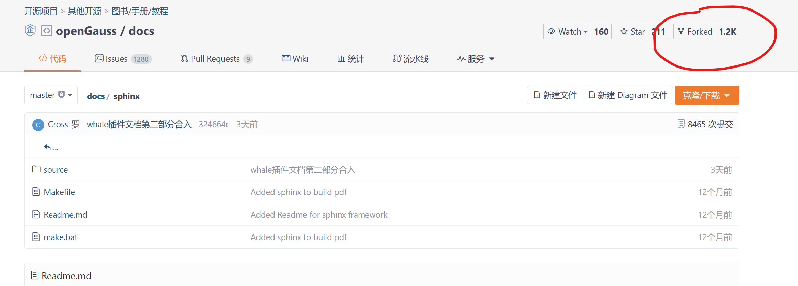
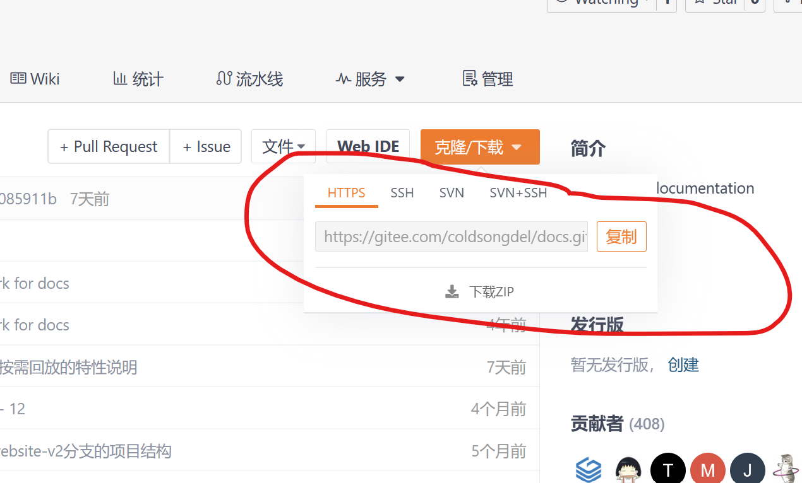
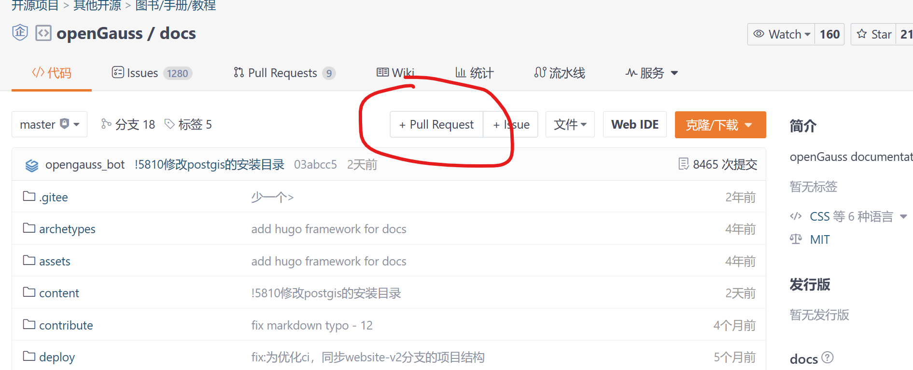
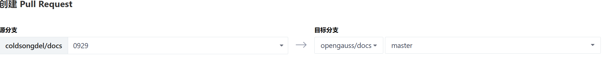

# 如何提交PR

PR(Pull Request)

## 1.fork需要提交的仓库到自己的存储库



## 2.本地新建文件夹

## 3.初始化本地git仓库

```bash
git init
```
## 4.添加远程仓库地址

>该地址为fork在你仓库的地址

复制链接


```bash
git remote add origin https://gitee.com/coldsongdevl/docs.git 
```
## 5.拉取远程存储库代码

```bash
git pull origin master
```
`master`为你要拉取的分支，可以修改

## 5.在拉取到的代码上作出修改

## 6.新建分支

一般来说，需要新建一个分支来修改代码，不应该在住分支修改(master)

```bash
git branch 1001
```
## 7.定位到分支

```bash
git checkout 1001
```

## 8.将修改的代码添加到该分支

```bash
git add .
```

## 9.提交代码

```bash
git commit -m '提交的内容'
```

## 10.同步修改的代码到自己的远程存储库

```bash
git push -f
```

## 提交PR

最后一步！
到自己fork的仓库，点击pull request

选择要提交的分支



点击提交就OK了


