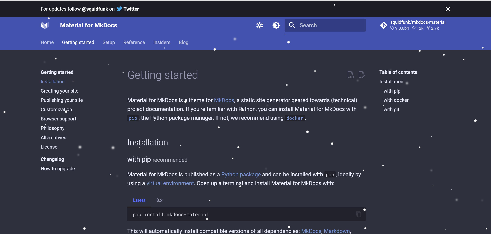
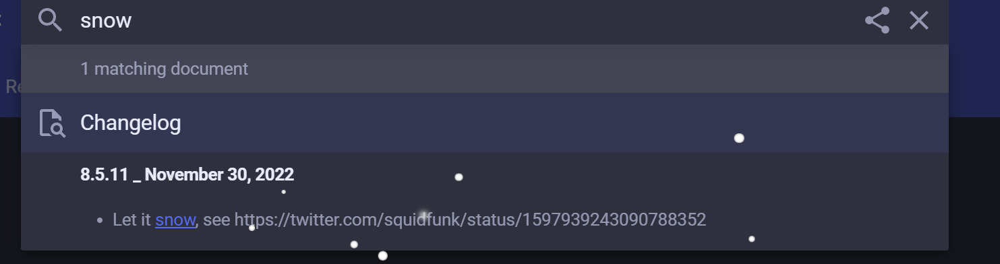
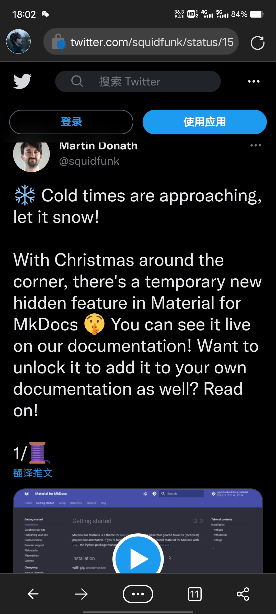
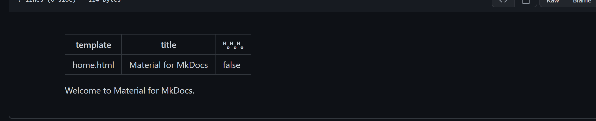
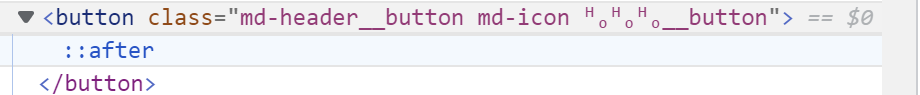
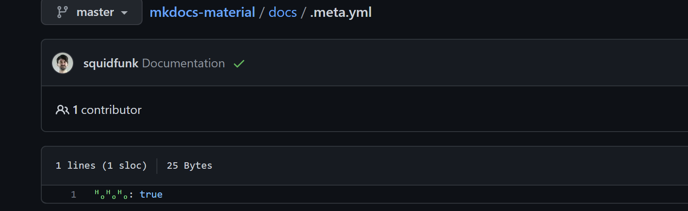
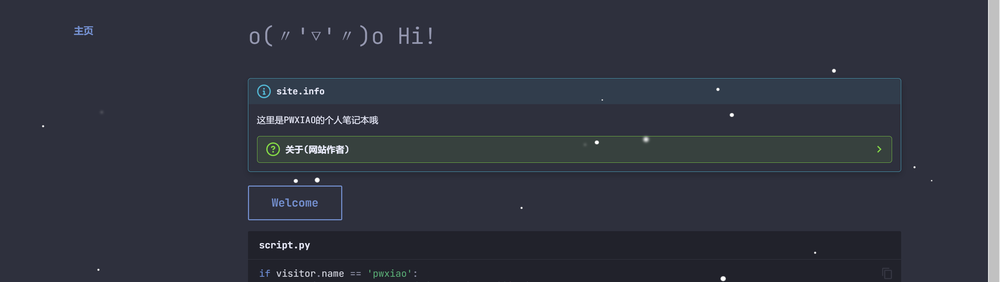

---

comments: true
---


# 记一次有趣的经历

!!! 前言
    这两天一直在用mkdocs建网站，上网四处找教程，很自然的我找到了mkdocs-material的官网
    https://squidfunk.github.io/mkdocs-material/

主页如下图


很明显这是典型的使用`mkdocs-material`主题生成的主页，但是吸引我注意的是主页的雪花特效，这是主页默认启动时无法显示的。

我很感兴趣，想知道这个雪花特效是怎么形成的。

歪打正着，我在页面随意收缩了一下`snow`这个单词，弹出的搜索结果如下图



上图显示`snow`这个关键字只在网站的changelog中出现过

后面有提示 `see https://twitter.com/squidfunk/status/1597939243090788352`

于是我顺着这个链接打开了（推特链接，需要使用魔法）
链接将指向这个推文


这是`mkdocs-material`作者squidfunk发布的一篇推文，他提到这个雪花特效已经内置在主题中，但是他将特效做成了一个彩蛋，默认不会打开，并希望邀请用户自己去发掘这个彩蛋。

顿时我发现，不经意的举动偶然让我参与了老外的一个游戏。

# 解谜过程

## 0x0001 mkdocs.yml
因为这个主题是开源的，我很轻的找到了开源地址
https://github.com/squidfunk/mkdocs-material

观察源代码文件不难看出，这个网站本身就是基于mkdcos-material开发的，在mkdocs主题中，最核心的文件是mkdocs.yml，页面的所有显示内容都是该文件说了算。

于是我打开了该文件[https://github.com/squidfunk/mkdocs-material/blob/master/mkdocs.yml](https://github.com/squidfunk/mkdocs-material/blob/master/mkdocs.yml).

再仔细观察一番后没发现什么异样。由此可见不是该文件的问题

## 0x0002 index.md
index.md是mkdocs站点的主页文件，我找到并进入[https://github.com/squidfunk/mkdocs-material/blob/master/docs/index.md](https://github.com/squidfunk/mkdocs-material/blob/master/docs/index.md)，文件很少,如下图



...并没发现什么异样

## 0x0003 f12开发者工具

源码中找不到线索，我来到站点打开了浏览器的开发者工具，对主页的雪花图标进行检查

元素指向了一个`button`,没啥异样
但是后面的`ᴴₒᴴₒᴴ` 吸引了注意，这个一个反复出现的字符，在上文说到的`index.md`中也出现了这个符号，
并且对应的布尔值是`false`,我立刻意识到，这也许就是雪花特效的开关，我来到网站主页，果然主页是没有雪花特效的，因此对应布尔值为`false`，这印证了我的猜想：`ᴴₒᴴₒᴴₒ`就是打开雪花特效的钥匙

但是知道这一点仍没有什么用，因为我在其他页面中没有发现
```cpp
ᴴₒᴴₒᴴₒ = true
```
这个属性，也就是说，`ᴴₒᴴₒᴴₒ`只是一个标志，在没有真正找到在哪启用时，无论怎么更改其属性值都是没用的。

## 0x0004 苦苦寻找

我又回到源码中仔细寻找，翻遍了与主页相关的css文件，仍没有进展，在快放弃之际，又是灵光一闪，我看到了一个`meta.yml`文件，在我的网站源码中我记得是没有这个文件的，于是我打开了他，一瞬间豁然开朗


熟悉的符号，我立刻意识到，这就是开启雪花特效的钥匙。

于是我回到自己的网站源文件，在相同位置，新建了一个`meta.yml`文件，并写入`ᴴₒᴴₒᴴₒ = true`

重新部署，芜湖，特效出来啦


## 解谜成功 o(〃'▽'〃)o