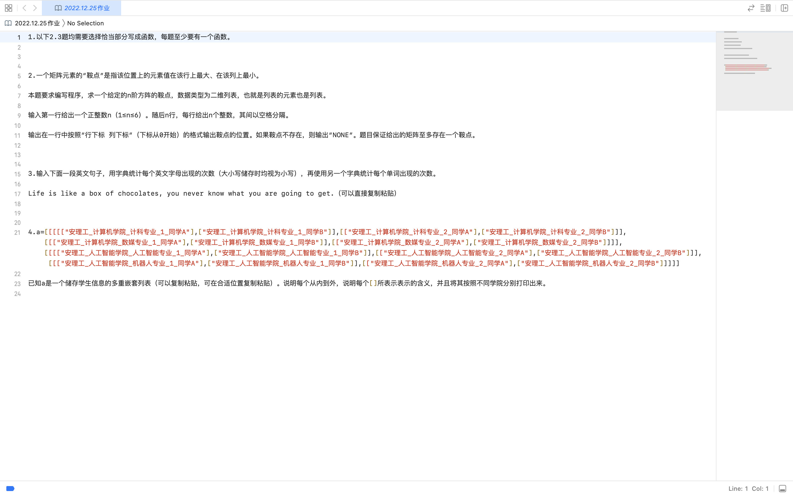

# python习题20221223


# 第二题
```python

##不可取
# array = []
# for i in range(n):
#     temp = []
#     for j in range(n):
#          temp.append(int(input()))
#     array.append(temp)

#检查函数
def check(i,j):
    s = array[i][j];
    flag1,flag2 = True,True
    for a in range(n):
        if s<array[i][a]:
            flag1 = False 
    for b in range(n):
        if s>array[b][j]:
            flag2 = False
    if (flag1 and flag2):
        return True
    return False;

#main
n = int(input())
array = [[0]*n]*n
for i in range(n):
    array[i] = [int(n) for n in input().split()]
f = (-1,-1)
for i in range(n):
    for j in range(n):
        if check(i,j):
            f = (i,j)  
            break
if f == (-1,-1):
    print("NONE")
else:
    print(f"坐标为{f}")

```
## 输出
```bash
2
3 2
5 1
坐标为(0, 0)
```

# 第二题
```python
eng = "a b c d e f g h i j k l m n o p q r s t u v w x y z"
dat = eng.split(' ')
data = {}
for key in dat:
    data[key] = 0

str = "Life is like a box of chocolates, you never know what you are going to get"
str = str.lower()

##这种写法默认值只遍历keys
for i in str:
    for j in data:
        if i == j:
            data[i]+=1
print(data)
```
## 输出
```bash
{'a': 4, 'b': 1, 'c': 2, 'd': 0, 'e': 7, 'f': 2, 'g': 3, 'h': 2, 'i': 4, 'j': 0, 'k': 2, 'l': 3, 'm': 0, 'n': 3, 'o': 9, 'p': 0, 'q': 0, 'r': 2, 's': 2, 't': 4, 'u': 2, 'v': 1, 'w': 2, 'x': 1, 'y': 2, 'z': 0}
```
# 第四题
```python
a=[[[[["安理工_ 计算机学院_计科专业_ 1_ 同学A"],["安理工. 计算机学院_计科专业_ 1_ 同学B"]],[["安理工_ 计算机学院计科专业_2_ 同学A"], ["安理工.计算机学院_计科专业_ .2_ 同学B"]]],
[[["安理工_计算机学院_数媒专业_ 1_ 同学A"], ["安理工_计算机学院_数媒专业_ 1_ 同学B"]],[["安理工_ 计算机学院_数媒专业_ _2_ 同学A"], ["安理工_计算机学院_数媒专业_ _2_ 同学B"]]]]                                                                                                          ,
[[[["安理工_人工智能学院_人工智能专业_ 1_ 同学A"],["安理工. 人工智能学院_人工智能专业_ 1. 同学B"]],[["安理工.人工智能学院_人工智能专业_ .2_ 同学A"],["安理工. 人工智能学院_人工智能专业2.同学B"]]],
[[["安理工_人工智能学院_机器人专业. 1.同学A"],["安理工_人工智能学院_机器人专业_ 1_ 同学B"]],[["安理工.人工智能学院_机器人专业_ .2_ 同学A"],["安理工_ 人工智能学院_机器人专业_ .2_ 同学B" ]]]]]                                                    


for i in range(2):
    print(a[i],end='\n\n')
```

## 输出
```bash
[[[['安理工_ 计算机学院_计科专业_ 1_ 同学A'], ['安理工. 计算机学院_计科专业_ 1_ 同学B']], [['安理工_ 计算机学院计科专业_2_ 同学A'], ['安理工.计算机学院_计科专业_ .2_ 同学B']]], [[['安理工_计算机学院_数媒专业_ 1_ 同学A'], ['安理工_计算机学院_ 数媒专业_ 1_ 同学B']], [['安理工_ 计算机学院_数媒专业_ _2_ 同学A'], ['安理工_计算机学院_数媒专业_ _2_ 同学B']]]]

[[[['安理工_人工智能学院_人工智能专业_ 1_ 同学A'], ['安理工. 人工智能学院_人工智能专业_ 1. 同学B']], [['安理工.人工智能学院_人工智能专业_ .2_ 同学A'], ['安理工. 人工智能学院_人工智能专业2.同学B']]], [[['安理工_人工智能学院_机器人专业. 1.同学A'], ['安理工_人工智能学院_机器人专业_ 1_ 同学B']], [['安理工.人工智能学院_机器人专业_ .2_ 同学A'], ['安理工_ 人工智能学院_机器人专业_ .2_ 同学B']]]]

```